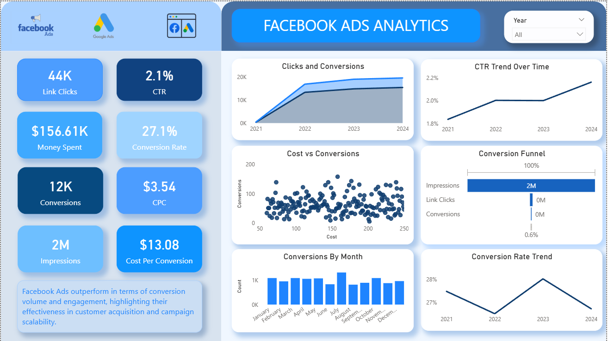
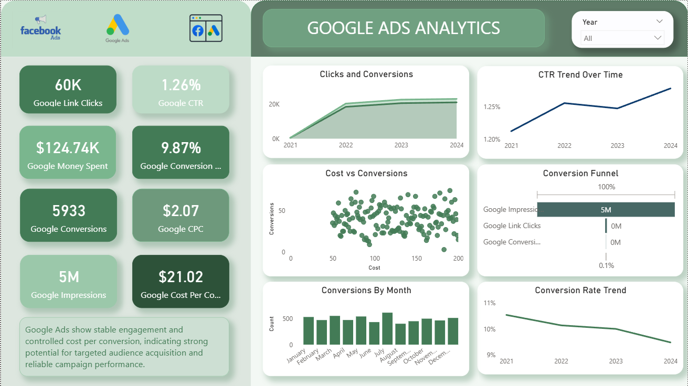

# Comparative A/B Testing Analysis of Facebook Ads and Google Ads

## Project Overview
Digital marketing campaigns are often run across multiple advertising platforms. However, businesses must evaluate which platform generates better engagement and higher conversions.

This project performs an **A/B testing analysis comparing Facebook Ads and Google Ads campaign performance** to identify which platform is more effective at driving conversions.

The analysis combines **Python for exploratory data analysis, statistical hypothesis testing for validation, and Power BI for interactive dashboard visualization** to generate meaningful marketing insights.

---

## Tools & Technologies
- Python  
- Pandas  
- NumPy  
- Matplotlib  
- Seaborn  
- SciPy  
- Power BI  
- Jupyter Notebook  

---

## Dataset
The dataset contains advertising campaign performance metrics from **Facebook Ads and Google Ads (AdWords)**.

Key features include:

- Campaign Date  
- Facebook Ad Clicks  
- Facebook Ad Conversions  
- Facebook Click Through Rate (CTR)  
- Facebook Conversion Rate  
- Google Ad Clicks  
- Google Ad Conversions  
- Google Click Through Rate (CTR)  
- Google Conversion Rate  

These metrics allow direct comparison between the two advertising platforms in terms of **engagement and conversion performance**.

---

## Project Workflow
1. Data Cleaning and Preprocessing using Python  
2. Exploratory Data Analysis (EDA) to understand campaign performance  
3. Visualization of CTR, clicks, and conversions  
4. Statistical **Hypothesis Testing** to evaluate performance differences  
5. Development of an interactive **Power BI dashboard** for business insights  

---

## Hypothesis Testing

To statistically determine whether one advertising platform performs better than the other, a **Two-Sample T-Test** was conducted.

### Null Hypothesis (H₀)
There is **no significant difference** in conversion performance between Facebook Ads and Google Ads.

### Alternative Hypothesis (H₁)
There **is a significant difference** in conversion performance between Facebook Ads and Google Ads.

### Statistical Test
A **two-sample t-test** was applied to compare the mean conversions between the two platforms.

Decision Rule:

- If **p-value < 0.05** → Reject the Null Hypothesis  
- If **p-value ≥ 0.05** → Fail to Reject the Null Hypothesis  

This statistical test helps determine whether observed performance differences are **statistically significant rather than random variation**.

---

## Key Insights
- Google Ads generally shows **higher conversion efficiency** compared to Facebook Ads.  
- Facebook Ads generate strong **user engagement and reach**.  
- Conversion rates vary depending on campaign conditions and targeting strategies.  
- Higher **Click Through Rate (CTR)** tends to correlate with higher conversions.  
- Campaign performance fluctuates across time, indicating opportunities for optimization.  

---

## Dashboard Preview






---

## Business Recommendations
- Allocate more budget to **Google Ads for conversion-focused campaigns**.  
- Use **Facebook Ads primarily for brand awareness and audience engagement**.  
- Continuously test different ad creatives and targeting strategies.  
- Monitor CTR and conversion rate metrics to improve campaign effectiveness.  
- Implement ongoing **A/B testing experiments** to optimize marketing performance.  

---

## Repository Structure
```
ab-testing-facebook-vs-google-ads

│
├── data
│   └── A_B_testing_dataset
│
├── notebook
│   └── ab_testing_analysis.ipynb
│
├── dashboard
│   └── ab_testing_analysis.pbix
│ 
├── dashboard_preview.png
├── dashboard_preview_1.png
├── dashboard_preview_2.png
├── Report.docx
│
└── README.md
```

---

## Conclusion
This project demonstrates a complete **end-to-end marketing campaign analysis workflow**:

Data preprocessing → Exploratory data analysis → Statistical hypothesis testing → Dashboard visualization.

The insights derived from this analysis help businesses understand **advertising performance across platforms**, enabling **data-driven marketing decisions and optimized advertising budgets**.
